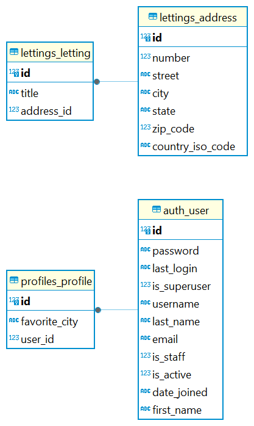

Description de la structure de la base de données et des modèles de données
===========================================================================

Les modèles principaux de l'application sont:

- *lettings* lié à *lettings_adresses* 

- et *profiles* lié à *user*

